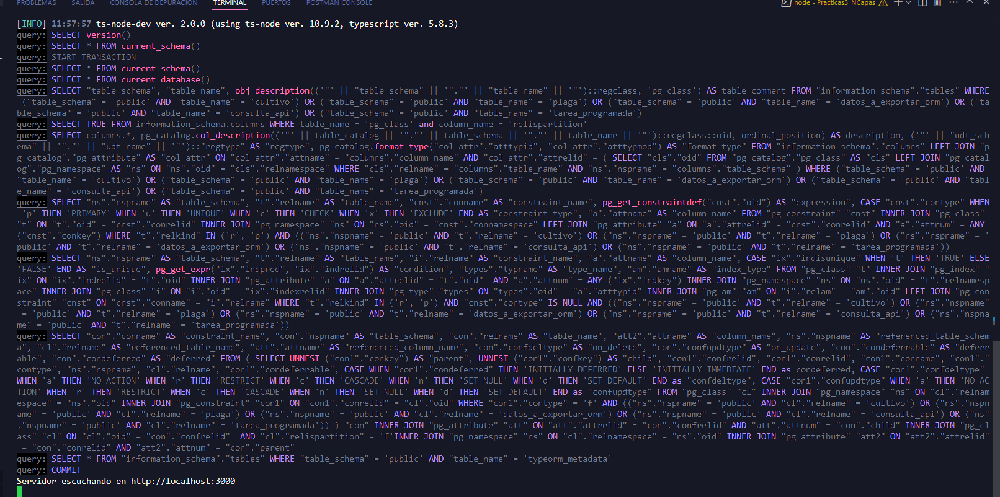
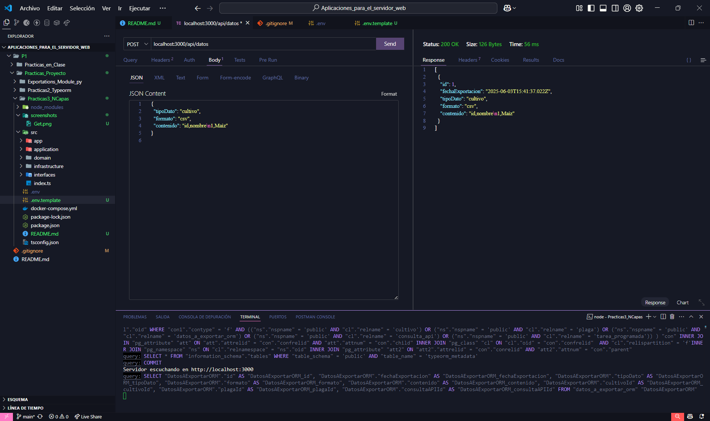
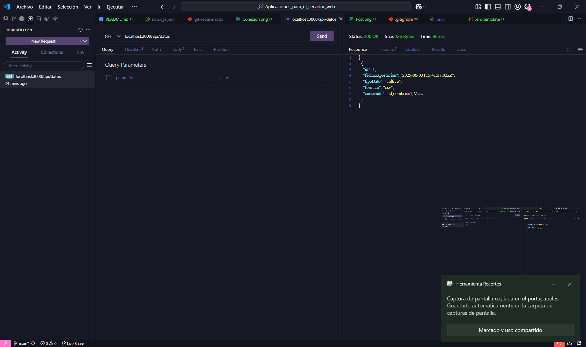
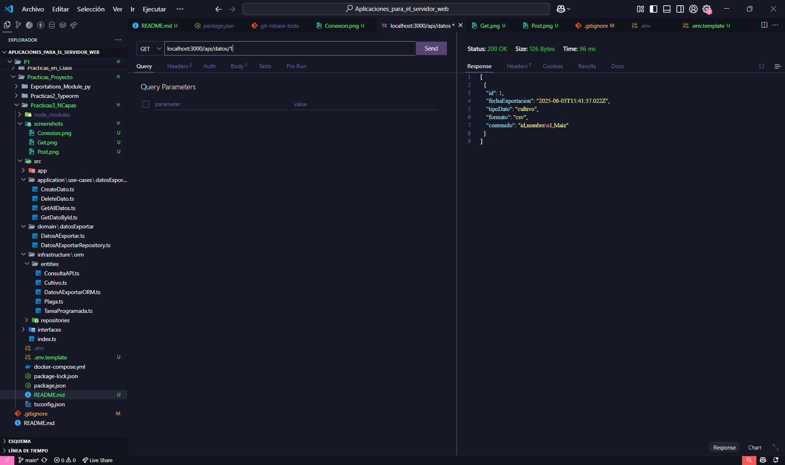

# Práctica - Arquitectura N-Capas con TypeORM

Este proyecto implementa la entidad `DatosAExportar` utilizando arquitectura en N-Capas, separando claramente la lógica de dominio, casos de uso, infraestructura y controladores. Se usa TypeORM para el acceso a datos.

---

## 🚀 Instrucciones para ejecutar el proyecto

### **Requisitos**
- Node.js y npm
- PostgreSQL (local o Docker)
- Git

---

### **1. Clonar el repositorio**

```bash
git clone https://github.com/mintriago123/Aplicaciones_para_el_servidor_web.git
cd .\P1\Practicas_Proyecto\Practicas3_NCapas\  
```

---

### **2. Configurar las variables de entorno**

Copia el archivo `.env.template` a `.env`:

```bash
cp .env.template .env
```

Edita `.env` para que coincida con tu configuración de PostgreSQL:

```env
DB_HOST=localhost
DB_PORT=5432
DB_USERNAME=postgres
DB_PASSWORD=tu_password
DB_NAME=nombre_base_datos
```

---

### **3. Instalar dependencias**

```bash
npm install
```

---

### **4. Ejecutar la aplicación**

```bash
npm run dev
```

---

## 📚 Endpoints REST de DatosAExportar

Todos los endpoints usan el path `/api/datos`

| Método | Endpoint | Descripción                        |
|--------|----------|------------------------------------|
| POST   | `/`      | Crear un nuevo registro            |
| GET    | `/`      | Listar todos los registros         |
| GET    | `/:id`   | Obtener un registro por ID         |
| DELETE | `/:id`   | Eliminar un registro por ID        |

Ejemplo de uso con Postman:

- **POST** `http://localhost:3000/api/datos`
  - Body (JSON):
    ```json
    {
      "campoEjemplo": "valor"
    }
    ```

- **GET** `http://localhost:3000/api/datos`

- **GET** `http://localhost:3000/api/datos/1`

- **DELETE** `http://localhost:3000/api/datos/1`

---

## 🖼️ Evidencias y pruebas (screenshots)

### **TypeORM**

* **Conexión exitosa:**
  
* **Crear (POST):**
  
* **Obtener todas (GET):**
  
* **Obtener por ID (GET):**
  


## 🏗️ Estructura del proyecto (N-Capas)

```
src/
├── domain/                  
│   └── models/
├── application/             # Casos de uso
│   └── use-cases/
├── infrastructure/
│   ├── orm/entities/        # Entidades ORM (TypeORM)
│   ├── repositories/        # Adaptadores de repositorio
│   └── database/            # Configuración de DataSource
├── interfaces/
│   ├── controllers/         # Lógica de controladores
│   └── routes/              # Rutas Express
├── app.ts                   # Configuración de la app Express
└── server.ts                # Entrada principal
```

---

## ✅ Características

- Arquitectura limpia y escalable.
- Separación total de responsabilidades.
- Repositorio adaptable a múltiples ORMs si se desea.
- Integración lista para pruebas con Postman.
- Código claro, mantenible y desacoplado.


---

## 👨‍💻 Autor

Michael Intriago

---

